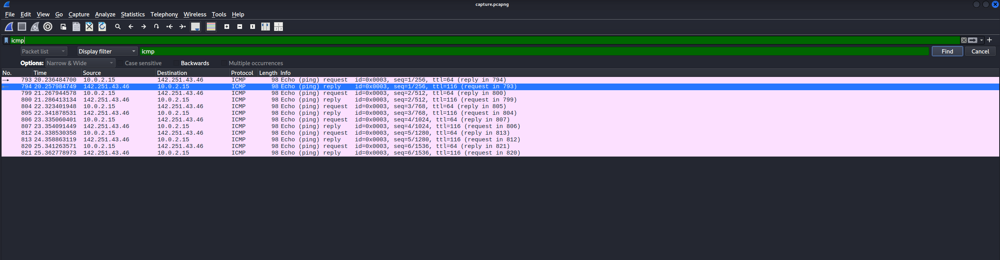
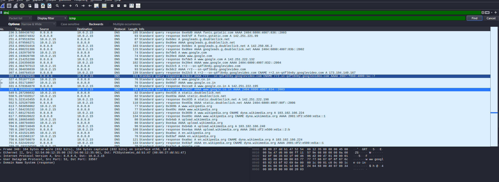
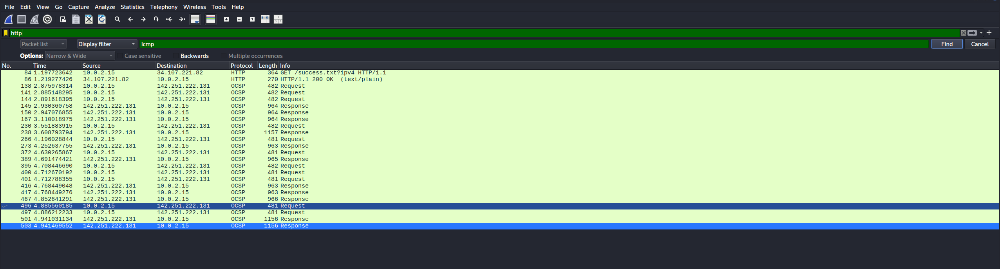

# 📡 Network Traffic Capture & Protocol Analysis with Wireshark (Kali Linux VM)

## 📖 Project Overview
This project demonstrates capturing and analyzing network traffic using [Wireshark](https://www.wireshark.org/) inside a **Kali Linux Virtual Machine** on VirtualBox.  
The `.pcap` file was created in a **controlled lab environment** to ensure it is safe for public sharing and free from sensitive data.

---

## 🛠 Tools & Environment
- **Host OS**: Windows 10/11  
- **Guest OS**: Kali Linux (VirtualBox)  
- **Software**: Wireshark (latest from Kali repositories)  
- **Command Line Utilities**: `ping`, `nslookup`  

---

## 🎯 Objectives
1. Capture live network traffic in a VM environment.  
2. Identify at least **three different protocols** in the capture.  
3. Export the capture as a `.pcap`/`.pcapng` file.  
4. Summarize the findings in a professional, portfolio-ready format.  

---

## 📌 Steps Performed
### 1.**Install Wireshark** in Kali:
   ```bash
   sudo apt update && sudo apt install wireshark
   sudo usermod -aG wireshark $USER
   ```
(Logged out and back in to apply permissions.)


### 2. Start Packet Capture:

Open Wireshark and select eth0 (active network interface).

Begin capturing.

### 3. Generate Safe Test Traffic:

- ping -c 4 google.com        # ICMP packets
- nslookup example.com        # DNS queries
- visit random websites on  Mozilla firefox
- Stop Capture after ~1 minute.

### 4.Apply Protocol Filters in Wireshark:

- icmp – Ping requests/replies

- dns – Domain name lookups

- http – Unencrypted HTTP traffic


### 5.Save Capture as `capture.pcapng` .

## 📊 Protocols Identified

Protocol	Layer	Purpose	Example Observation
- **ICMP**	Network	Diagnostic messages (ping)	Echo request/reply to Google
- **DNS**	Application	Domain name resolution	Query for example.com
- **HTTP**	Application	Transfer of web data	GET / request to example.com
- **TCP**	Transport	Reliable data transport	3-way handshake with remote server
- **TLS**	Application	Encryption for HTTPS	TLS Client Hello to example.com

 
## 📸 Screenshots

### ICMP Traffic


### DNS Traffic


### HTTP Traffic


## 📑 Key Learnings
- Safely capturing packets in a controlled lab environment for public sharing.

- Using Wireshark filters to isolate protocols of interest.

- Understanding the structure and purpose of ICMP, DNS, HTTP, TCP, and TLS traffic.

- Linking packet-level data to real-world network behavior.

## 📜 References
- [Wireshark Documentation](https://www.wireshark.org/docs/)   
- [Wireshark Display Filter Cheat Sheet](https://packetlife.net/media/library/13/Wireshark_Display_Filters.pdf)  


